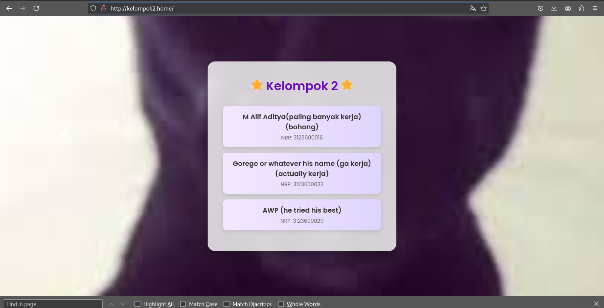

# Laporan Konfigurasi DNS Server dengan BIND9

---

Mata Kuliah : Workshop Administrasi Jaringan

Dosen Pengampu : Dr Ferry Astika Saputra ST, M.Sc

Kelompok 5

Anggota :

1. Fransiska Elsa Dina Mareta (3123600006)
2. Shalsabilla Wahyu Arifhana (3123600014)
3. Eugenia Valiant Van True (3123600018)

---

## Tujuan

Membuat konfigurasi DNS server menggunakan BIND9 pada sistem operasi Debian, serta melakukan pengecekan konfigurasi dan pengujian dengan perintah `dig` ke beberapa domain kelompok, serta menampilkan halaman web berdasarkan domain tersebut.

## Langkah-Langkah Pengerjaan

### 1. Pengaturan Wired Settings

Set IP address secara manual melalui pengaturan Wired Settings sesuai dengan gambar berikut:


### 2. Verifikasi IP Address

Cek IP address menggunakan perintah ip a, hasil yang relevan:

```bash
2: enp2s0: <BROADCAST,MULTICAST,UP,LOWER_UP>
inet 192.168.5.10/24 brd 192.168.5.255 scope global noprefixroute enp2s0
```

### 3. Instalasi Paket yang Diperlukan

Pertama-tama dilakukan instalasi paket BIND9, Apache2, dan utilitasnya:

```bash
sudo apt update
sudo apt install bind9 bind9utils apache2 -y

```

### 4. Konfigurasi File named.conf

Buka file konfigurasi utama:

```bash
sudo nano /etc/bind/named.conf

```

Pastikan file ini berisi include ke file konfigurasi tambahan seperti:

```bash
include "/etc/bind/named.conf.options";
include "/etc/bind/named.conf.local";
include "/etc/bind/named.conf.default-zones";

```

### 5. Konfigurasi File named.conf.options

File ini diatur agar DNS server dapat melakukan forward query:

```bash
sudo nano /etc/bind/named.conf.options

```

Contoh konfigurasi:

```bash
options {
    directory "/var/cache/bind";

    forwarders {
        10.252.108.10;
        10.10.10.1;
    };

    allow-query { localhos; internal-network; };
    allow-transfer { localhost; };
    recursion yes;
};

```

### 6. Membuat File Zona

Buat file zona berdasarkan konfigurasi di atas:

```bash
sudo nano /etc/bind/kelompok5.home

```

Sesuaikan isi file zona:


### 7. Pemeriksaan Konfigurasi

Setelah konfigurasi dilakukan, lakukan pengecekan sintaks dengan:

```bash
sudo named-checkconf
sudo named-checkzone
```

### 8. Restart Layanan BIND9

```bash
sudo systemctl restart bind9

```

### 9. Pengujian dengan Perintah `dig`

Pengujian dilakukan untuk nama domain beberapa kelompok:

```bash
dig kelompok5.home
dig kelompok3.home
```

### 10. Hasil Output `dig`

### Output dari `dig kelompok5.home`


### Output dari `dig kelompok3.home`


### 11. Menampilkan Website Berdasarkan Domain

Setelah DNS berhasil mengarahkan domain seperti `kelompok5.home`, langkah selanjutnya adalah menampilkan halaman web menggunakan domain tersebut.

1. Buka folder web root:

```bash
cd /var/www/html

```

1. Buat atau edit file `index.html` 
2. Pastikan Apache sudah berjalan:

```bash
sudo systemctl restart apache2
```

1. Akses web melalui browser dengan URL:

```bash
http://kelompok5.home/
```

Jika konfigurasi DNS dan Apache sudah benar, maka akan tampil halaman HTML dari `index.html`.


Website kelompok lain seperti `http://kelompok2.home/` juga dapat diakses jika DNS telah mengarahkannya dengan benar ke server yang menjalankan layanan web.



### 10. Kesimpulan

Konfigurasi DNS server menggunakan BIND9 berhasil dilakukan dengan benar. Hal ini dibuktikan dengan hasil pengecekan konfigurasi tanpa error, pengujian query DNS menggunakan `dig`, serta kemampuan untuk menampilkan halaman web dengan menggunakan domain `kelompok5.home` dan domain kelompok lain.

Selain konfigurasi DNS, layanan web seperti Apache juga perlu dikonfigurasi dan dijalankan untuk memastikan domain yang diarahkan dapat menampilkan halaman web sesuai yang diinginkan.
