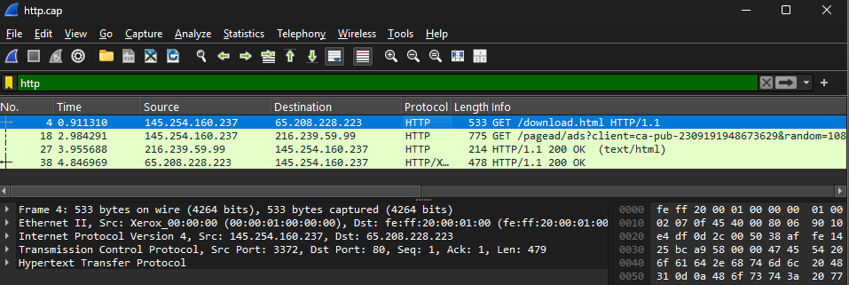
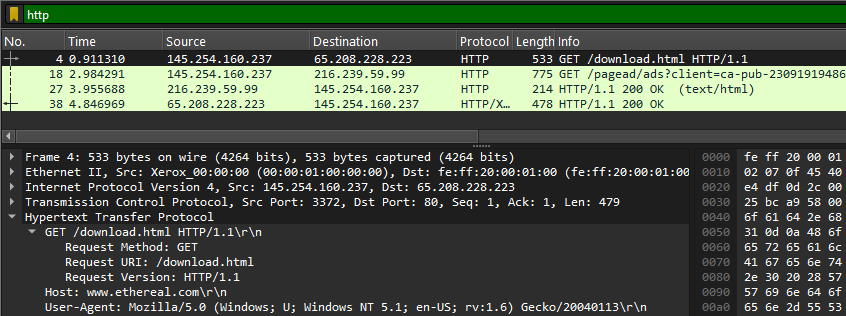
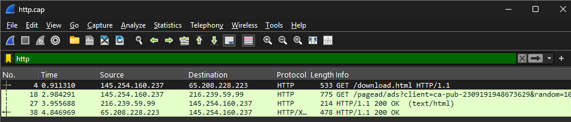
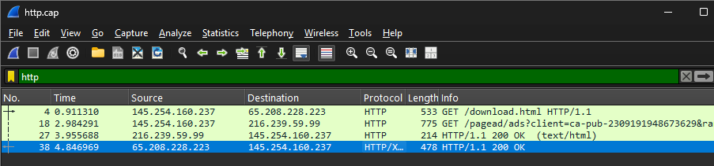
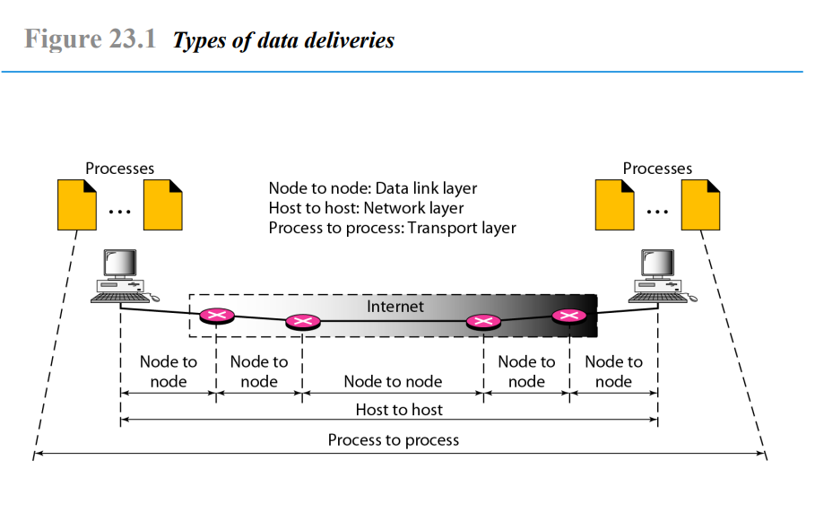

# LAPORAN TUGAS

## Tugas Review

**Mata kuliah Workshop Administrasi Jaringan**

**Nama dosen pengampu:**

Dr Ferry Astika Saputra ST, M.Sc

**Dikerjakan oleh**

Nama	: Eugenia Valiant Van True  
NRP		: 3123600018  
Kelas	: 2 D4 IT A  

---

## Analisis http.cap

### Analisis IP Server dan Client

- Filter hasil dengan menggunakan "http" di kolom filter
- Cari packet HTTP Request dengan keterangan metode GET/POST
- Temukan kolom Source (untuk IP Client) dan Destination (untuk IP Server)
  
> **Pada gambar tersebut, dapat disimpulkan bahwa IP Client adalah 145.254.160.237 dan IP Server adalah 65.208.228.223**

### Versi HTTP

- Pilih salah satu packet HTTP Request
- Pada packet details, temukan kolom ‘Request Version’ pada header Hypertext Transfer Protocol
  
> **Pada gambar tersebut, dapat disimpulkan bahwa versi http adalah HTTP/1.1**

### Waktu Client Mengirim Request

- Pilih salah satu packet HTTP Request
- Perhatikan kolom Time pada packet
  
> **Pada gambar tersebut dapat disimpulkan bahwa waktu client mengirim request adalah 0.911310 detik setelah capture dilakukan**

### Waktu Server Menerima HTTP Request dari Client

- Pilih packet HTTP Response yang sama seperti sebelumnya
- Perhatikan kolom Time
- Perhatikan waktu saat server mengirimkan respons
  
> **Pada gambar tersebut, dapat disimpulkan bahwa server menerima http request dari client pada detik ke 4.846969 setelah capture dilakukan**

### Waktu yang Dibutuhkan untuk Transfer dan Response dari Client ke Server

Perhitungan waktu yang dibutuhkan untuk transfer dan response dari client ke server (RTT) dapat dilakukan menggunakan:

```
RTT = Waktu HTTP Response – Waktu HTTP Request
RTT = 4.846969 - 0.911310
RTT = 3.935659
```

---

## Analisis Gambar

### Type of Data Deliveries

Gambar tersebut menjelaskan jenis-jenis pengiriman data dalam jaringan komputer berdasarkan lapisan OSI, khususnya dalam proses komunikasi dari satu perangkat ke perangkat lain melalui internet. Berikut adalah proses yang terjadi dalam gambar:

1. **Process to Process (Lapisan Transport)**
   - Komunikasi terjadi antara dua proses yang berjalan di perangkat berbeda.
   - Contohnya, aplikasi browser di komputer A mengirim permintaan HTTP ke server web di komputer B.
   - Protokol yang digunakan adalah TCP atau UDP.

2. **Host to Host (Lapisan Jaringan)**
   - Setelah data dikirim dari suatu proses, data akan dikemas dalam paket IP untuk dikirim antar host.
   - Di proses ini, alamat IP sumber dan IP tujuan digunakan untuk mengarahkan data ke perangkat yang benar.
   - Protokol yang digunakan adalah IP.

3. **Node to Node (Lapisan Data Link)**
   - Data bergerak melalui jaringan dari satu node (perangkat jaringan seperti router atau switch) ke node lain.
   - Data akan melewati berbagai router sebelum sampai ke tujuan.
   - Protokol yang digunakan adalah Ethernet, Wi-Fi, PPP (Point-to-Point Protocol), dll.

### Alur Pengiriman Data

- Proses di komputer sumber memulai komunikasi dengan komputer tujuan.
- Data diproses pada lapisan transport (TCP/UDP) untuk memastikan pengiriman ke proses yang benar.
- Data dikemas dalam paket IP untuk dikirim dari satu host ke host lain melalui internet.
- Paket data dikirim dari node ke node (misalnya melalui router) hingga mencapai komputer tujuan.
- Setelah sampai di host tujuan, data diproses dan diberikan ke proses penerima.

### Kesimpulan

- **Node to Node**: Proses di lapisan data link untuk mengirimkan data antar perangkat dalam jaringan.
- **Host to Host**: Proses di lapisan jaringan yang menangani pengiriman data antar perangkat berdasarkan IP.
- **Process to Process**: Proses di lapisan transport yang memastikan komunikasi antar aplikasi berjalan dengan benar.

Gambar di atas menggambarkan bagaimana data berpindah dari satu komputer ke komputer lain melalui internet menggunakan konsep OSI Layer Model.

---

## Resume Tahapan TCP: Establishment, Data Transfer, dan Termination

### TCP Connection Establishment (Three-Way Handshake)

Proses ini digunakan untuk membentuk koneksi antara klien dan server sebelum melakukan pertukaran data. Berikut adalah tahapannya:

1. **SYN (Synchronize)**
   - Klien mengirimkan SYN ke server untuk memulai koneksi.
   - Paket ini berisi Initial Sequence Number (ISN) dari klien.

2. **SYN-ACK (Synchronize-Acknowledge)**
   - Server menerima paket SYN dan membalas dengan SYN-ACK.
   - Server juga mengirimkan ISN miliknya sebagai tanggapan.

3. **ACK (Acknowledge)**
   - Klien mengirimkan ACK sebagai konfirmasi penerimaan SYN-ACK.
   - Koneksi TCP berhasil terbentuk, dan siap untuk transfer data.

### Data Transfer

- Data dikirim dalam bentuk segmen TCP.
- Setiap segmen memiliki Sequence Number dan Acknowledgment Number untuk menjamin data diterima dengan benar.
- **Flow Control** digunakan untuk mengatur aliran data antara pengirim dan penerima.
- **Error Control** memastikan data yang diterima tidak rusak menggunakan mekanisme retransmisi jika terjadi kehilangan paket.

### TCP Connection Termination (Four-Way Handshake)

Proses ini dilakukan untuk mengakhiri koneksi dengan aman setelah transfer data selesai. Tahapan:

1. **FIN (Finish)**
   - Salah satu pihak (klien atau server) mengirimkan FIN untuk mengakhiri sesi komunikasi.

2. **ACK (Acknowledge)**
   - Pihak penerima mengirimkan ACK untuk mengonfirmasi bahwa permintaan terminasi diterima.

3. **FIN (Finish)**
   - Pihak yang menerima FIN kemudian mengirim FIN untuk menutup koneksi dari sisinya.

4. **ACK (Acknowledge Final)**
   - Pengirim pertama mengirimkan ACK terakhir, menandakan bahwa koneksi telah ditutup sepenuhnya.

Setelah tahap ini, koneksi berakhir dan kedua pihak kembali ke status **CLOSED**.
